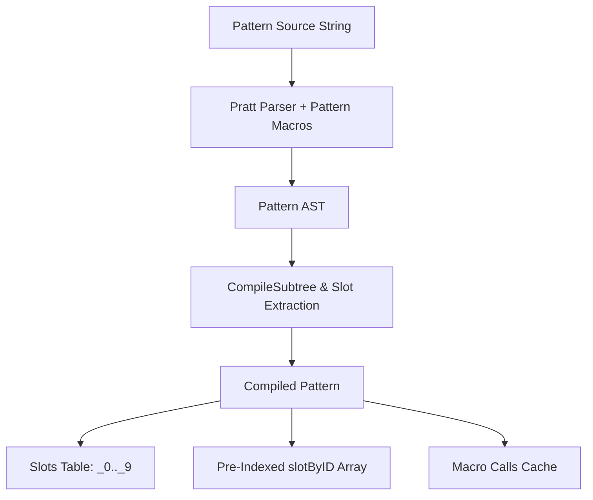
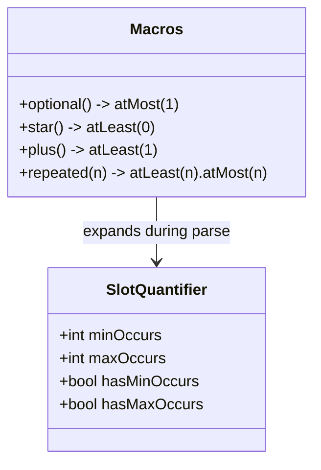
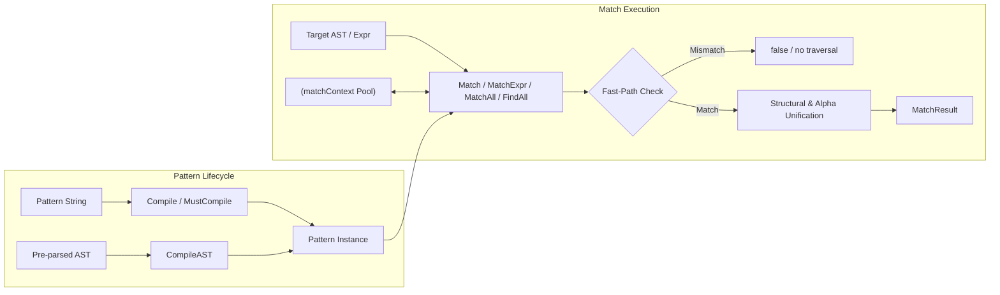
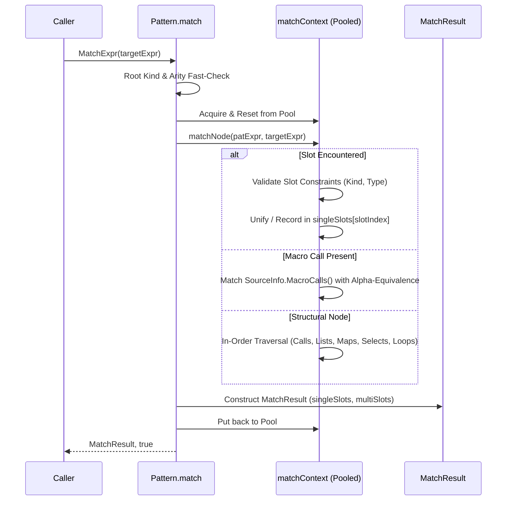

# AST Pattern Matcher Design

## 1. Overview

CEL tooling frequently needs to recognize the *shape* of an expression:
linters detect anti-patterns such as `_1 == _1`, optimizers extract
comprehension loop steps, and validators reject disallowed sub-expressions.

`ast.EquivAST` and `ast.EquivExpr` in
[`common/ast/equiv.go`](../common/ast/equiv.go) answer whether two ASTs are
structurally equivalent. The matcher generalizes that comparison: one side
becomes a *pattern* containing **slots** that match and capture arbitrary
sub-expressions.

Patterns are written in ordinary CEL. Sentinel identifiers (`_`, `_0`..`_9`)
and receiver macros supply the pattern vocabulary, so no grammar or lexer
changes are required.

> [!NOTE]
> Matching is structural. Proof of semantic equivalence is a separate concern,
> available from the CEL-Java verifier tool.

---

## 2. Pattern Syntax

### 2.1 Slots

| Concept | Syntax | Matches |
| :--- | :--- | :--- |
| Anonymous wildcard | `_` | Any sub-expression, captures nothing. |
| Positional slot | `_0` .. `_9` | Any sub-expression, captured by index. |
| Kind constraint | `_1.exprKind(ident)` | Nodes of a given `ast.ExprKind`. |
| Type constraint | `_1.type(int)` | Nodes of a given checked type. |
| Collections | `[_1.star()]`, `{_1.star(): _2.star()}` | List elements and map entries. |



Slot indices are limited to `_0`..`_9`, which lets captures live in fixed-size
arrays rather than maps. `_10` and beyond are rejected at compile time.

#### Kind Constraints

`exprKind` accepts `ident`, `call`, `select`, `list`, `map`, `struct`,
`literal`, and `comprehension`. Struct matching may be narrowed to a single
message type:

```cel
_1.exprKind(struct, google.protobuf.Duration)
```

#### Type Constraints

`type` accepts any name the configured `types.Provider` can resolve, such as
`_1.type(int)` or `_1.type(google.protobuf.Duration)`. Unresolvable names fail
at compile time, and matching requires a checked AST.

#### Validation

Repeating `exprKind` or `type` on one slot, or combining contradictory bounds
(`.star().plus()`, `.atLeast(5).atMost(2)`), is a compile error.

---

### 2.2 Quantifiers

Within call arguments, list elements, and map entries, a slot may match a
contiguous run of nodes.



`atLeast(m)` and `atMost(n)` set the bounds directly. The receiver macros
expand into those calls during parsing:

| Macro | Expansion | Cardinality |
| :--- | :--- | :--- |
| `_1.optional()` | `_1.atMost(1)` | 0 or 1 |
| `_1.star()` | `_1.atLeast(0)` | 0 or more |
| `_1.plus()` | `_1.atLeast(1)` | 1 or more |
| `_1.repeated(n)` | `_1.atLeast(n).atMost(n)` | exactly n |

Variable quantifiers are only valid in the final position of a sequence.
Fixed-cardinality slots such as `_1` and `_1.repeated(2)` may appear anywhere,
so `[_1.repeated(2), _2.star()]` compiles while `[_1.star(), _2]` does not.

---

### 2.3 Matching Rules

| Rule | Example |
| :--- | :--- |
| Map entries match in order | `{'a': _1, 'b': _2}` matches `{'a': 1, 'b': 2}`, not `{'b': 2, 'a': 1}` |
| Entry quantifiers bind key and value | `{_1.star(): _2.star()}` |
| Struct fields match in order, exhaustively | `pkg.Msg{a: _1, b: _2}` matches only two-field messages |
| Optionality must agree | `{?'k': _1}` matches `{?'k': v}`, not `{'k': v}` |
| Qualified calls are folded | `pkg.fn(_1)` matches `pkg.fn(x)` |
| Macros match expanded or unexpanded targets | `_1.filter(x, true)` matches with or without macro call tracking |

---

## 3. Using the Matcher

### 3.1 Compiling

| Constructor | Input |
| :--- | :--- |
| `Compile` / `MustCompile` | Pattern source |
| `CompileAST` / `MustCompileAST` | Pre-parsed pattern AST |

`TypeProvider(provider)` supplies the provider used to resolve `type()`
constraints; `ParserOptions(opts...)` adds parser options. Compiled patterns
are immutable and safe for concurrent use.

### 3.2 Matching

| Method | Target | Notes |
| :--- | :--- | :--- |
| `Match` | `*ast.AST` | Matches the root; required for `type()` constraints. |
| `MatchExpr` | `ast.Expr` | Matches any sub-expression, such as a loop step. |
| `MatchAll` / `MatchAllExpr` | either | Invokes a handler per match; return `false` to stop. |
| `FindAll` / `FindAllExpr` | either | Collects matches into a slice. |

Traversal is in-order and matches may overlap. `MatchDisjoint()` skips matched
subtrees, `MatchMaxDepth(n)` bounds the traversal depth, and
`MatchEquivOptions(opts...)` forwards equivalence options. Matching `_1 + 0`
against `((a + 0) * (b + 0)) + 0`:

| Call | Matches |
| :--- | :--- |
| `FindAll(target)` | 3 |
| `FindAll(target, MatchDisjoint())` | 1 |
| `FindAll(target, MatchMaxDepth(0))` | 1 |

### 3.3 Reading Results

Slots are read by index, so `_1` is `FirstExpr(1)`. Raw accessors return
`ast.Expr` directly; navigable accessors return `ast.NavigableExpr` with
parent links and types when the match started from an `*ast.AST`.

| Accessor | Empty capture | Unbound slot |
| :--- | :--- | :--- |
| `FirstExpr(i)` / `FirstRawExpr(i)` | `(nil, false)` | `(nil, false)` |
| `Exprs(i)` / `RawExprs(i)` | `([], true)` | `(nil, false)` |

```go
p, err := matcher.Compile("_1 + 0",
    matcher.TypeProvider(env.CELTypeProvider()))
if err != nil {
    return err
}

if res, ok := p.Match(checked.NativeRep()); ok {
    operand, _ := res.FirstExpr(1)
    fmt.Println(operand.Kind(), operand.Type())
}

for _, res := range p.FindAll(checked.NativeRep(), matcher.MatchDisjoint()) {
    operand, _ := res.FirstRawExpr(1)
    _ = operand
}
```

---

## 4. Engine Design



- **Fast-path rejection**: root expression kinds, slot kind constraints, and
  call arity are checked before any traversal, context acquisition, or AST
  navigation, so mismatches cost no allocations.
- **Pre-indexed slots**: pattern node IDs index a `slotByID` slice, making the
  "is this node a slot?" test an array lookup rather than a map lookup.
- **Pooled match state**: recursive state lives in a `sync.Pool`-managed
  `matchContext`, with identifier stacks reset in place.
- **Fixed-slot storage**: captures are held in `[10]` arrays, so single-node
  slots bind without allocating a slice.
- **Dual-mode results**: `FirstRawExpr` / `RawExprs` return `ast.Expr` with no
  wrapper allocation for compiler-hot paths, while `FirstExpr` / `Exprs`
  return `ast.NavigableExpr` for linting and validation.

---

## 5. Match Semantics



1. **Default equivalence**: matching applies
   `ast.EquivIgnoreIdentifiers(true)` and `ast.EquivMacroCalls(true)`. Caller
   options override the defaults.
2. **Slot consistency**: a slot repeated in a pattern must bind equivalent
   expressions, so `_1 == _1` matches `claims.sub == claims.sub` but not
   `claims.sub == claims.iss`.
3. **Macro matching**: macro calls recorded in `SourceInfo.MacroCalls()` are
   compared directly, and comprehension variables are unified, so
   `_1.all(x, x > 0)` matches `items.all(it, it > 0)`.
4. **Map sequences**: entries match in order and each consumes one key and one
   value, so `{_1.star(): _2.star()}` matches any map while `{_1: _2.star()}`
   matches a single entry.

---

## 6. Examples

### 6.1 Arithmetic & Boolean Reductions

| Pattern | Expression | Captures |
| :--- | :--- | :--- |
| `_1 + 0` | `(a * b) + 0` | `_1 = a * b` |
| `_1 - _1` | `user.age - user.age` | `_1 = user.age` |
| `_1 && true` | `(x > 10 && y < 20) && true` | `_1 = x > 10 && y < 20` |
| `_1 == _1` | `claims.sub == claims.sub` | `_1 = claims.sub` |
| `!(!_1)` | `!(!isValid)` | `_1 = isValid` |

### 6.2 Conditionals & Comprehensions

| Pattern | Expression | Captures |
| :--- | :--- | :--- |
| `_1 ? _2 : _2` | `isValid ? 42 : 42` | `_1 = isValid`, `_2 = 42` |
| `_1 != null ? _1 : _2` | `user.profile != null ? user.profile : fallback` | `_1 = user.profile`, `_2 = fallback` |
| `_1.filter(x, true)` | `users.filter(u, true)` | `_1 = users` |
| `_1.filter(x, _2).filter(x, _3)` | `users.filter(u, u.active).filter(u, u.age >= 18)` | `_1 = users`, `_2 = u.active`, `_3 = u.age >= 18` |

### 6.3 Sequences & Collections

| Pattern | Expression | Captures |
| :--- | :--- | :--- |
| `concat(_1, _2.star())` | `concat("prefix", a, b, "suffix")` | `_1 = "prefix"`, `_2 = [a, b, "suffix"]` |
| `slice(_1, _2, _3.optional())` | `slice(items, 0)` | `_1 = items`, `_2 = 0` |
| `[_1.repeated(2), _2.star()]` | `[10, 20, 30, 40]` | `_1 = [10, 20]`, `_2 = [30, 40]` |
| `{_1.star(): _2.star()}` | `{'a': 1, 'b': 2}` | `_1 = ['a', 'b']`, `_2 = [1, 2]` |
| `{'prefix': 0, _1.star(): _2.star()}` | `{'prefix': 0, 'a': 1}` | `_1 = ['a']`, `_2 = [1]` |

### 6.4 Comprehension Loop Steps

`[1, 2, 3].filter(x, x > 0)` expands to a comprehension whose `LoopStep()` is
`x > 0 ? __result__ + [x] : __result__`:

```go
p := matcher.MustCompile("_1 ? _2.exprKind(ident) + [_3] : _2")
res, ok := p.MatchExpr(comp.LoopStep())
// _1 = predicate, _2 = accumulator, _3 = appended element
```

Repeating `_2` in both branches ties the accumulator to a single expression.

---

## 7. Future Work

### 7.1 Declarative AST Optimizers & Term Rewriters

Authoring optimizers still requires procedural transformation logic. A
declarative rewrite framework could add:
- **Rewrite rule chains**: paired `(Pattern, Replacement)` rules where
  replacement templates rebuild subtrees from captured slots.
- **Fixpoint drivers**: applying rule sets until an AST reaches normal form.
- **Cost-based rewriting**: feeding pattern-driven rewrites into the
  comprehension optimizer and cost estimator.

### 7.2 Declarative Structural Macros

CEL macros are procedural Go functions (`parser.MacroExpander`). Pattern
matching and slot unification supply the engine for declarative alternatives:


- **Hygienic expansion**: scope tracking keeps synthetic iteration variables
  from clashing with surrounding scopes.
- **Macro inversion**: applying rules in reverse to reconstruct macro syntax
  from expanded ASTs when unparsing.

### 7.3 Zero-Allocation Match Sinks

Pooled or callback-based sinks (`p.MatchWithSink(target, &sink)`) would remove
the remaining `MatchResult` allocations from embedded compiler loops.
