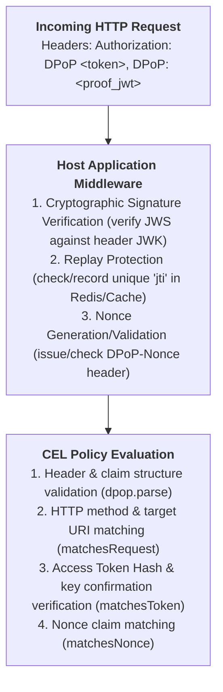

# DPoP Extension

The DPoP extension library provides CEL functions and types for validating OAuth 2.0
Demonstrating Proof of Possession (DPoP) proof tokens per [RFC 9449](https://www.rfc-editor.org/rfc/rfc9449).

## Configuration

Import `cel.dev/cel-go/ext/security/dpop` and add `dpop.Library(options...)` to the CEL environment:

```go
import "cel.dev/cel-go/ext/security/dpop"

env, err := cel.NewEnv(
    dpop.Library(
        dpop.ValidateTimes(5 * time.Minute), // Optional proof age / iat validation
        dpop.AllowedAlgorithms("ES256", "RS256"), // Optional JWS algorithm allowlist
    ),
)
```

### Options

* `dpop.ValidateTimes`: Enables automatic validation of the `iat` creation timestamp during parsing. Proofs with timestamps in the future or older than `maxAge` (plus leeway) evaluate to `optional.none()`.
* `dpop.AllowedAlgorithms`: Restricts acceptable JWS signing algorithms (e.g. `"ES256"`, `"RS256"`, `"EdDSA"`).
* `dpop.Clock`: Overrides the clock source for time validations (defaults to `time.Now().UTC`).
* `dpop.ClockLeeway`: Configures clock skew tolerance for time claims.

---

## CEL Functions

### dpop.parse

Parses a DPoP proof JWT string into an `optional<dpop.Proof>`. Automatically strips any leading `DPoP ` prefix if present.

Validates RFC 9449 structure and security requirements during parse:
- Header `typ` MUST be `dpop+jwt`.
- Header `alg` MUST be an asymmetric algorithm (symmetric `HS*` and `none` are rejected).
- Header `jwk` MUST be a valid public key and MUST NOT contain private key parameters (`d`, `p`, `q`, etc.) or symmetric keys (`oct`).
- Payload MUST contain `jti`, `htm`, `htu`, and `iat`.

```cel
dpop.parse(<string>) -> <optional<dpop.Proof>>
```

Examples:

```cel
dpop.parse(request.headers['dpop']).hasValue()
dpop.parse('DPoP eyJ0eXAiOiJkcG9wK2p3dCIs...').value().method == 'POST'
```

---

### matchesRequest

Validates that the DPoP proof's HTTP method (`htm`) and target URI (`htu`) claims match the expected request parameters.

Performs RFC 3986 and RFC 9449 URI syntax normalization:
- Lowercases scheme and hostname.
- Removes standard default ports (`:80` for HTTP, `:443` for HTTPS).
- Resolves relative path segments (`.` and `..`).
- Ignores query (`?query=...`) and fragment (`#fragment`) components.

Can be called directly on `dpop.Proof` or on `optional<dpop.Proof>` (evaluates to `false` if `optional.none()`).

```cel
<dpop.Proof>.matchesRequest(<string>, <string>) -> <bool>
<optional<dpop.Proof>>.matchesRequest(<string>, <string>) -> <bool>
```

Examples:

```cel
// Authorization server / Token endpoint validation:
dpop.parse(request.headers['dpop']).matchesRequest(request.method, request.url)

// Protected resource endpoint validation:
proof.matchesRequest('GET', 'https://resource.example.org/api/orders')
```

---

### matchesToken

Validates that the DPoP proof matches the presented access token. Simultaneously performs dual checks:

1. **Access Token Hash (`ath`)**: Verifies that the proof's `ath` claim matches the `base64url(sha256(token))` hash of the presented access token string.
2. **Public Key Confirmation (`cnf.jkt`)**: If the token is a JWT with a `cnf` confirmation claim, validates that `cnf.jkt` matches the DPoP proof's RFC 7638 JWK thumbprint.

Accepts either a token string (with optional `DPoP ` / `Bearer ` prefix) or a parsed `jwt.Token` object.

```cel
<dpop.Proof>.matchesToken(<string>) -> <bool>
<dpop.Proof>.matchesToken(<jwt.Token>) -> <bool>
<optional<dpop.Proof>>.matchesToken(<string>) -> <bool>
<optional<dpop.Proof>>.matchesToken(<jwt.Token>) -> <bool>
<optional<dpop.Proof>>.matchesToken(<optional<jwt.Token>>) -> <bool>
```

Examples:

```cel
// Pass authorization header directly:
dpop.parse(request.headers['dpop']).matchesToken(request.headers['authorization'])

// Pass parsed JWT token from the jwt extension:
dpop.parse(request.headers['dpop']).matchesToken(jwt.parse(request.headers['authorization']))
```

---

### matchesNonce

Validates that the DPoP proof's `nonce` claim matches the expected server-provided challenge nonce. Performs constant-time comparison to prevent timing attacks.

```cel
<dpop.Proof>.matchesNonce(<string>) -> <bool>
<optional<dpop.Proof>>.matchesNonce(<string>) -> <bool>
```

Examples:

```cel
dpop.parse(request.headers['dpop']).matchesNonce(serverNonce)
```

---

### claim

Queries a custom or standard claim from the DPoP proof payload by key name, returning an `optional<dyn>`.

```cel
<dpop.Proof>.claim(<string>) -> <optional<dyn>>
<optional<dpop.Proof>>.claim(<string>) -> <optional<dyn>>
```

Examples:

```cel
proof.claim('nonce').orValue('')
dpop.parse(request.headers['dpop']).claim('custom_claim').hasValue()
```

---

## Direct Field Access

A `dpop.Proof` instance exposes the following strongly typed fields:

| Field | CEL Type | Description |
| :--- | :--- | :--- |
| `id` | `string` | Unique proof token identifier (`jti`) |
| `method` | `string` | HTTP request method (`htm`) |
| `uri` | `string` | HTTP target URI (`htu`) |
| `iat` | `timestamp` | Proof creation timestamp (`iat`) |
| `accessTokenHash` | `string` | Access token hash (`ath`), empty if omitted |
| `nonce` | `string` | Server nonce challenge (`nonce`), empty if omitted |
| `thumbprint` | `string` | RFC 7638 SHA-256 JWK thumbprint computed from header `jwk` |
| `alg` | `string` | JWS signing algorithm from header (e.g. `"ES256"`) |
| `keyId` | `string` | Key identifier (`kid`) from header, empty if omitted |

---

## Security Model: CEL vs. Host Application

DPoP verification per RFC 9449 requires coordination between CEL policy evaluation and host application middleware:



### 1. Responsibilities of CEL
- Validates RFC 9449 proof structure, header parameters, and required claims.
- Performs URI syntax and scheme normalization per RFC 3986.
- Verifies Access Token Hash (`ath`) and key confirmation (`cnf.jkt`) matching.
- Compares server nonces using constant-time algorithms.
- Evaluates custom authorization rules against proof and token claims.

### 2. Responsibilities of the Host Application (Caller)
- **Signature Verification**: Because CEL is a policy evaluation language, the host application MUST verify the cryptographic signature of the DPoP proof against the public key extracted from the header `jwk` before trusting the proof.
- **Replay Protection**: CEL is stateless and cannot maintain cross-request state. The host application MUST store and enforce the uniqueness of the `jti` claim within the acceptable time window (e.g. in Redis, Memcached, or an in-memory cache).
- **Nonce Lifecycle**: If the server requires DPoP nonces (RFC 9449 Section 8), the host application must generate and return nonces via the `DPoP-Nonce` HTTP header.

---

## Implementer Tools (Go API)

The `dpop` package provides exported Go helper utilities to assist host implementers with cryptographic tasks:

### Nonce Generation & Validation
```go
// Stateful / Random Nonce (for storage in cache):
nonce, err := dpop.GenerateNonce()

// Stateless / Distributed Nonce (HMAC-signed with timestamp and optional context):
secretKey := []byte("server-secret-key")
statelessNonce, err := dpop.GenerateStatelessNonce(secretKey, clientIP, clientID)

// Validate stateless nonce signature, age, and context in constant time:
isValid := dpop.ValidateStatelessNonce(statelessNonce, secretKey, 2*time.Minute, clientIP, clientID)
```

### Access Token Hashing & JWK Thumbprints
```go
// Compute RFC 9449 ath hash: base64url(sha256(accessToken))
ath := dpop.ComputeAccessTokenHash(rawAccessToken)

// Compute RFC 7638 SHA-256 JWK thumbprint (jkt) for RSA, EC, and OKP keys:
thumbprint, err := dpop.ComputeJWKThumbprint(jwkMap)
```

---

## Example CEL Policies

### Token Endpoint / Authorization Server

```cel
// Validate that the request was accompanied by a valid DPoP proof bound to the token endpoint
cel.bind(proof, dpop.parse(request.headers['dpop']),
  proof.matchesRequest(request.method, request.url) &&
  proof.matchesToken(request.headers['authorization'])
)
```

### Protected Resource Endpoint

```cel
// Validate method, URI, access token binding (ath + cnf.jkt), and server nonce challenge
proof.matchesRequest(request.method, request.url) &&
proof.matchesToken(request.headers['authorization']) &&
proof.matchesNonce(serverNonce)
```
